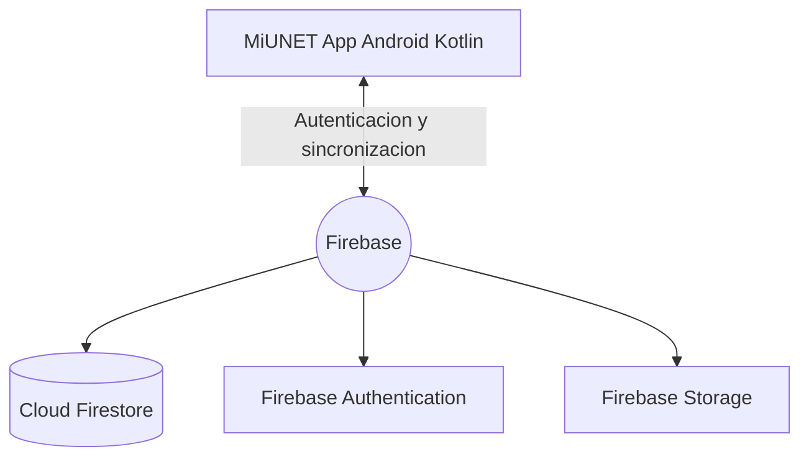
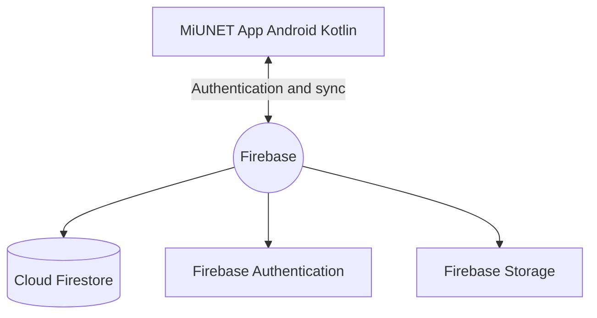

<div align="center">
  
  
  

  <h1>MiUNET App</h1>
  <p><strong>Plataforma integral universitaria para la UNET</strong></p>

  <a href="[ENLACE_DESCARGA_APK]" target="_blank">
    
  </a>
</div>

## Tabla de contenido | Table of contents

- [Espanol](#espanol)
- [English](#english)

---

## Espanol

### Resumen del proyecto

MiUNET es una aplicacion nativa Android para centralizar informacion academica e institucional de la Universidad Nacional Experimental del Tachira (UNET). Integra autenticacion por roles, contenido actualizado en tiempo real y herramientas de asistencia para estudiantes, profesores y personal administrativo.

### Demo visual (premium)

Reemplaza estos enlaces por tus recursos reales (capturas y GIFs):

| Vista | Recurso |
|---|---|
| Pantalla de login |  |
| Dashboard principal |  |
| Modulo de tramites |  |
| Chatbot en accion (GIF) |  |

### Funcionalidades por rol

| Feature | Estudiante | Profesor | Administrador |
|---|---:|---:|---:|
| Iniciar sesion seguro | Si | Si | Si |
| Ver informacion institucional | Si | Si | Si |
| Consultar chatbot academico | Si | Si | Si |
| Gestionar perfil de usuario | Si | Si | Si |
| Publicar o editar contenido | No | Limitado | Si |
| Administrar modulos y datos | No | No | Si |

### Impacto del proyecto (enfoque reclutador)

Incluye tus resultados para reforzar CV/portafolio:

- Alcance estimado: [N] estudiantes potenciales
- Tiempo promedio ahorrado por consulta: [X] minutos
- Reduccion de pasos para tramites frecuentes: [Y]%
- Velocidad de carga percibida: [X] segundos en vistas principales
- Modulos funcionales implementados: [N]

### Logros tecnicos

- Implementacion de arquitectura cliente-servidor con Firebase
- Integracion de Firebase Authentication, Firestore y Storage
- Diseno de UI modular en XML con enfoque escalable
- Separacion funcional por fragmentos para facilitar mantenimiento

### Arquitectura



### Stack tecnologico

| Categoria | Tecnologia |
|---|---|
| Lenguaje | Kotlin |
| IDE | Android Studio |
| Base de datos | Firebase Cloud Firestore |
| Autenticacion | Firebase Authentication |
| UI | Material Design 3 + XML |
| Arquitectura | Cliente-servidor |
| Control de versiones | Git y GitHub |

### Estructura del proyecto

```text
MiUNET-APP/
|- app/
|  |- src/main/java/com/example/.../
|  |- src/main/res/
|  |- build.gradle.kts
|  |- google-services.json
|- gradle/
|- build.gradle.kts
|- settings.gradle.kts
|- README.md
```

### Instalacion local

1. Clona el repositorio:

```bash
git clone https://github.com/JuanD-2005/MiUNET.git
```

2. Abre la carpeta en Android Studio y sincroniza Gradle.
3. Agrega tu archivo google-services.json en app/.
4. Ejecuta la configuracion app en emulador o dispositivo fisico.

### Compilacion CLI

Windows:

```bash
gradlew.bat assembleDebug
```

Linux/macOS:

```bash
./gradlew assembleDebug
```

APK generado en app/build/outputs/apk/debug/.

---

## English

### Project summary

MiUNET is a native Android app designed to centralize academic and institutional information for Universidad Nacional Experimental del Tachira (UNET). It provides role-based authentication, real-time synced content, and assistance tools for students, professors, and administrative staff.

### Visual demo (premium)

Replace these placeholders with your real screenshots and GIFs:

| View | Asset |
|---|---|
| Login screen |  |
| Main dashboard |  |
| Procedures module |  |
| Chatbot in action (GIF) |  |

### Features by role

| Feature | Student | Professor | Admin |
|---|---:|---:|---:|
| Secure sign-in | Yes | Yes | Yes |
| View institutional information | Yes | Yes | Yes |
| Use academic chatbot | Yes | Yes | Yes |
| Manage personal profile | Yes | Yes | Yes |
| Publish or edit content | No | Limited | Yes |
| Manage modules and data | No | No | Yes |

### Project impact (recruiter focus)

Add measurable outcomes to strengthen your portfolio:

- Potential reach: [N] students
- Average time saved per query: [X] minutes
- Fewer steps in frequent procedures: [Y]%
- Perceived load speed in core screens: [X] seconds
- Functional modules delivered: [N]

### Technical achievements

- Client-server architecture using Firebase
- Firebase Authentication, Firestore, and Storage integration
- Scalable XML UI implementation with modular structure
- Fragment-based feature separation for maintainability

### Architecture



### Tech stack

| Category | Technology |
|---|---|
| Language | Kotlin |
| IDE | Android Studio |
| Database | Firebase Cloud Firestore |
| Authentication | Firebase Authentication |
| UI | Material Design 3 + XML |
| Architecture | Client-server |
| Version control | Git and GitHub |

### Local setup

1. Clone the repository.
2. Open it in Android Studio and sync Gradle.
3. Add your google-services.json file into app/.
4. Run app on an emulator or physical Android device.

### APK download

Update the [ENLACE_DESCARGA_APK] button at the top with your latest APK URL.

---

## Contribuciones | Contributing

1. Haz fork del repositorio / Fork this repository
2. Crea una rama de trabajo / Create a feature branch
3. Haz commits descriptivos / Write clear commits
4. Abre un Pull Request / Open a Pull Request

## Licencia | License

Define aqui la licencia final (ejemplo: MIT) para aclarar uso y distribucion del proyecto.