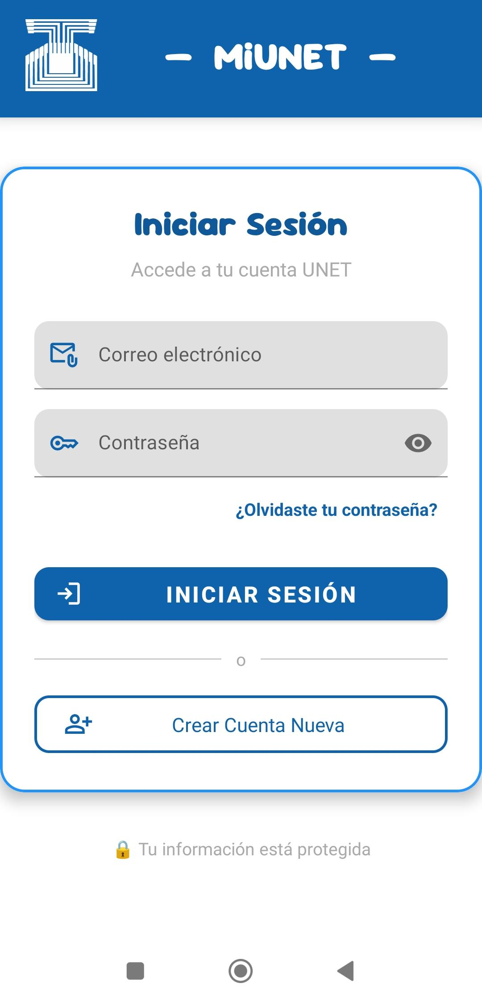
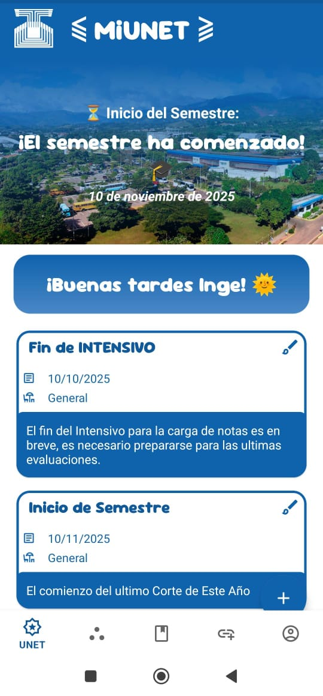
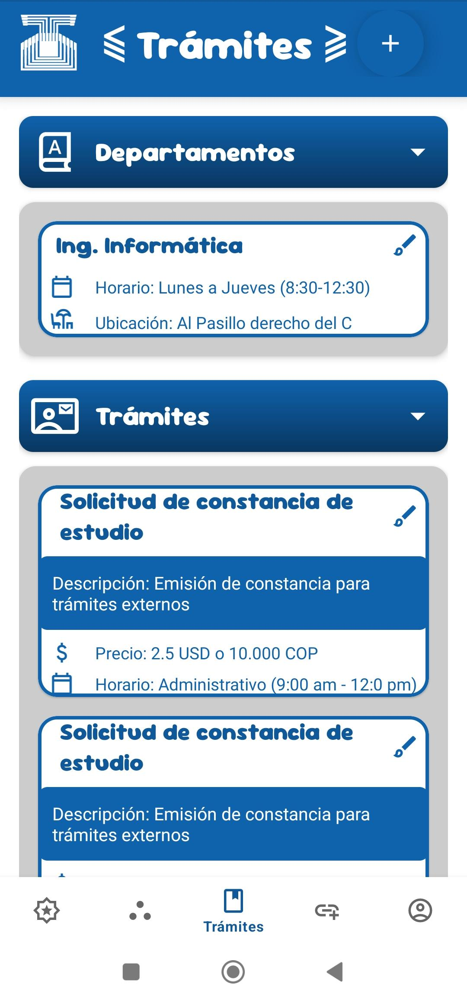
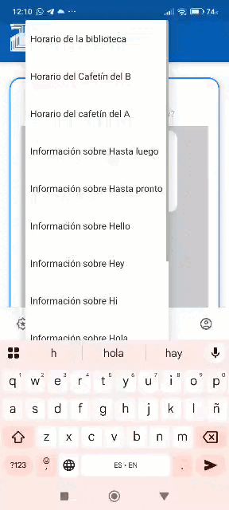
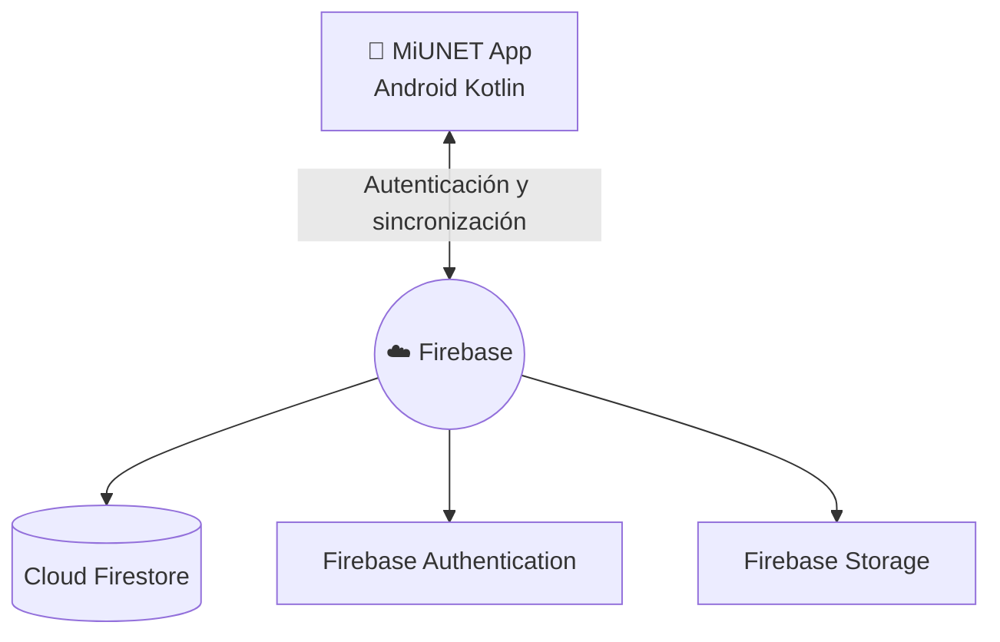
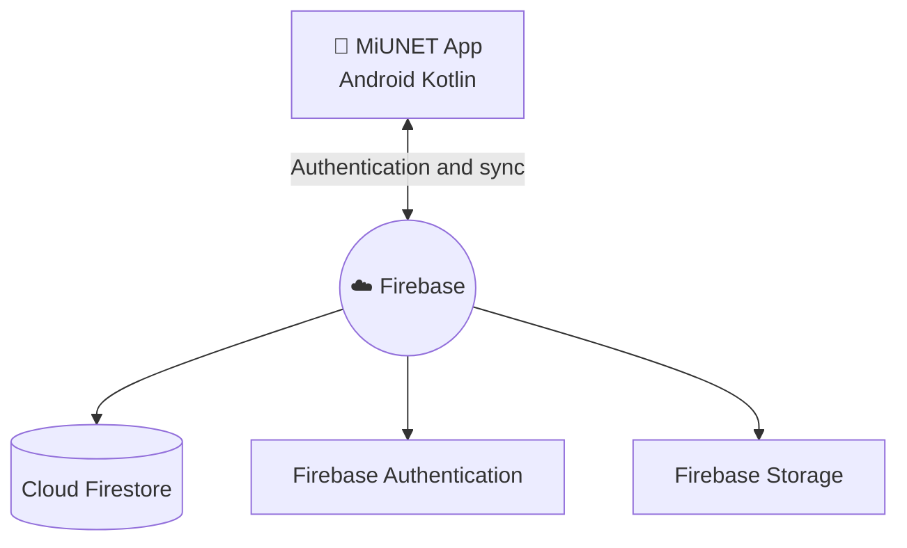

<div align="center">
  
  
  

  <h1>📱 MiUNET App</h1>
  <p><strong>Plataforma integral universitaria para la UNET</strong></p>

  <a href="https://juand-2005.github.io/MiUNET/ target="_blank">
    
  </a>
</div>

<br>

## 🌍 Tabla de contenido | Table of contents

- [Español](#español)
- [English](#english)

---

## 🇪🇸 Español

### 📝 Resumen del proyecto

MiUNET es una aplicación nativa Android diseñada para centralizar la información académica e institucional de la Universidad Nacional Experimental del Táchira (UNET). Integra autenticación por roles, contenido sincronizado en tiempo real y herramientas de asistencia para estudiantes, profesores y personal administrativo.

### 📱 Demo visual

| Vista | Captura |
|---|---|
| **Pantalla de login** |  |
| **Dashboard principal** |  |
| **Módulo de trámites** |  |
| **Chatbot inteligente** |  |

### 🔐 Funcionalidades por rol

| Feature | Estudiante | Profesor | Administrador |
|---|---:|---:|---:|
| Iniciar sesión seguro | ✅ | ✅ | ✅ |
| Ver información institucional | ✅ | ✅ | ✅ |
| Consultar chatbot académico | ✅ | ✅ | ✅ |
| Gestionar perfil de usuario | ✅ | ✅ | ✅ |
| Publicar o editar contenido | ❌ | Limitado | ✅ |
| Administrar módulos y datos | ❌ | ❌ | ✅ |

### 📈 Impacto del proyecto

- **Alcance estimado:** Diseñado para +[N] estudiantes.
- **Eficiencia:** Ahorro promedio de [X] minutos por consulta administrativa.
- **Optimización:** Reducción del [Y]% de los pasos necesarios para trámites frecuentes.
- **Rendimiento:** Velocidad de carga percibida de [X] segundos en vistas principales gracias a la arquitectura NoSQL.

### ⚙️ Logros técnicos

- Implementación de arquitectura cliente-servidor nativa con Firebase.
- Integración de Firebase Authentication, Firestore y Storage.
- Diseño de interfaz (UI) modular en XML con enfoque escalable (Material Design 3).
- Separación funcional por Fragmentos para optimizar el mantenimiento del ciclo de vida de la app.

### 🏗️ Arquitectura



### 🛠️ Stack tecnológico

| Categoría | Tecnología |
|---|---|
| **Lenguaje** | Kotlin |
| **IDE** | Android Studio |
| **Base de datos** | Firebase Cloud Firestore |
| **Autenticación** | Firebase Authentication |
| **UI** | Material Design 3 + XML |
| **Arquitectura** | Cliente-servidor |
| **Control de versiones** | Git y GitHub |

### 💻 Instalación local

1. Clona el repositorio:

```bash
git clone https://github.com/JuanD-2005/MiUNET.git
```

2. Abre la carpeta en Android Studio y sincroniza Gradle.
3. Agrega tu archivo `google-services.json` en el directorio `app/`.
4. Ejecuta la configuración `app` en un emulador o dispositivo físico.

**Compilación CLI (Opcional):**

- Windows: `gradlew.bat assembleDebug`
- Linux/macOS: `./gradlew assembleDebug`
  *(El APK se generará en `app/build/outputs/apk/debug/`)*

---

## 🇺🇸 English

### 📝 Project summary

MiUNET is a native Android application designed to centralize academic and institutional information for the Universidad Nacional Experimental del Táchira (UNET). It provides role-based authentication, real-time synced content, and smart assistance tools for students, professors, and administrative staff.

### 📱 Visual demo

| View | Asset |
|---|---|
| **Login screen** |  |
| **Main dashboard** |  |
| **Procedures module** |  |
| **Chatbot in action** |  |

### 🔐 Features by role

| Feature | Student | Professor | Admin |
|---|---:|---:|---:|
| Secure sign-in | ✅ | ✅ | ✅ |
| View institutional info | ✅ | ✅ | ✅ |
| Use academic chatbot | ✅ | ✅ | ✅ |
| Manage personal profile | ✅ | ✅ | ✅ |
| Publish or edit content | ❌ | Limited | ✅ |
| Manage modules & data | ❌ | ❌ | ✅ |

### 📈 Project impact

- **Potential reach:** Designed to support +[N] active students.
- **Efficiency:** Average time saved per query is [X] minutes.
- **Optimization:** [Y]% fewer steps required for frequent administrative procedures.
- **Performance:** Perceived load speed of [X] seconds in core screens via NoSQL architecture.

### ⚙️ Technical achievements

- Native client-server architecture built entirely with Firebase.
- Seamless integration of Firebase Authentication, Firestore, and Storage.
- Scalable XML UI implementation following Material Design 3 guidelines.
- Fragment-based feature separation to ensure maintainability and proper lifecycle management.

### 🏗️ Architecture



### 🛠️ Tech stack

| Category | Technology |
|---|---|
| **Language** | Kotlin |
| **IDE** | Android Studio |
| **Database** | Firebase Cloud Firestore |
| **Authentication** | Firebase Authentication |
| **UI** | Material Design 3 + XML |
| **Architecture** | Client-server |
| **Version control** | Git and GitHub |

### 💻 Local setup

1. Clone the repository:

```bash
git clone https://github.com/JuanD-2005/MiUNET.git
```

2. Open it in Android Studio and sync Gradle.
3. Add your `google-services.json` file into the `app/` directory.
4. Run the `app` configuration on an emulator or physical Android device.

---

## 🤝 Contribuciones | Contributing

1. Haz fork del repositorio / Fork this repository
2. Crea una rama de trabajo / Create a feature branch (`git checkout -b feature/AmazingFeature`)
3. Haz commits descriptivos / Write clear commits (`git commit -m 'Add some AmazingFeature'`)
4. Abre un Pull Request / Open a Pull Request

## 📄 Licencia | License

Distribuido bajo la licencia MIT. / Distributed under the MIT License.
